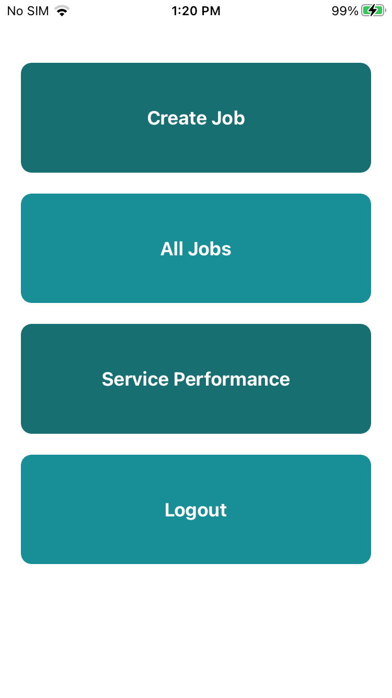
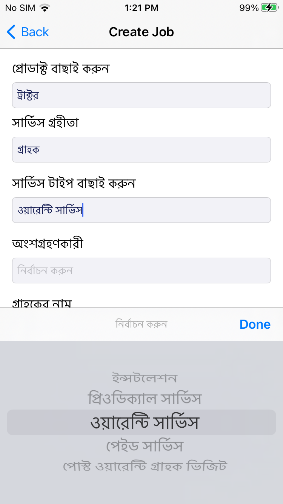
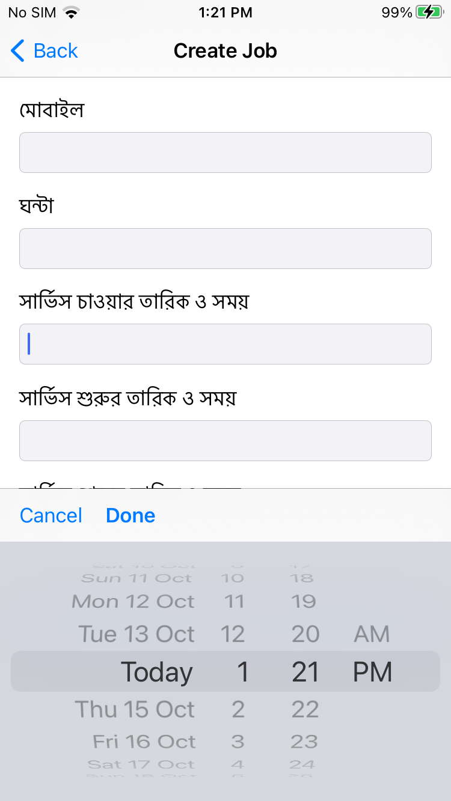
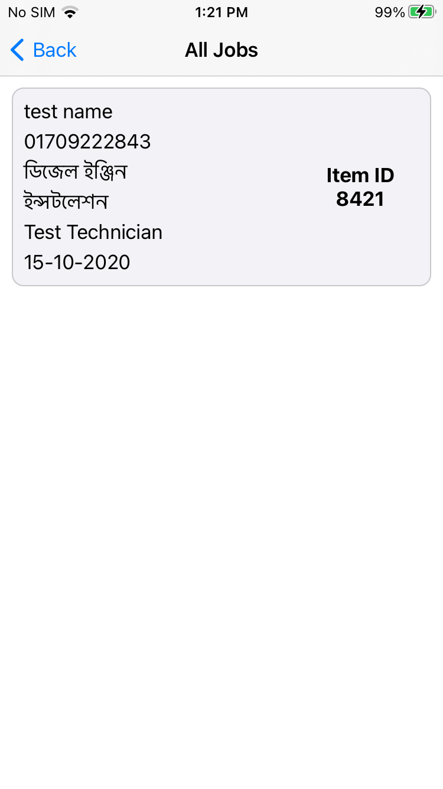
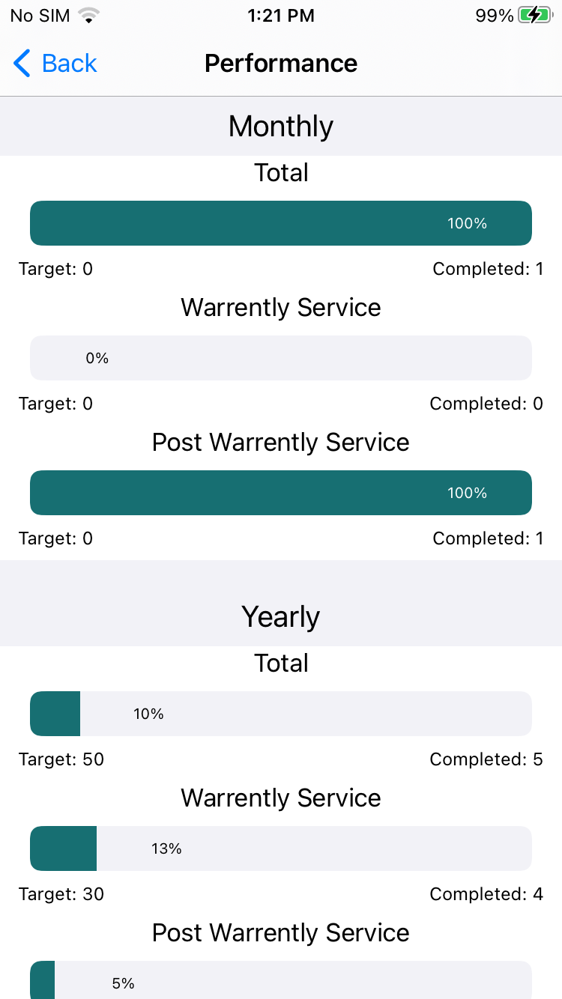

# Swift-iOS-Porjects
iOS project 

### Yums Food

#### Stack
1. TableView
2. CollectionView
3. Create View Programatically
4. Nib
5. TabBar
6. Navigation Controller
7. SearchBar in tableview
8. Customize View
9. Collection view Header Footer
10. Auto Scroll banner
11. Custom Cells

Home              |  Category            |  Profile         |  Search                |  Search 
:----------------:|:----------------: |:----------------: |:----------------: |:----------------:
  |   |  |  | 

### Service App

#### Stack
1. TableView
2. Nib
3. URLSession
4. RxSwift
5. Mvvm

Page 1              |  Page 2             |  Page 3          |  Page 4                |  Page 5  
:----------------:|:----------------: |:----------------: |:----------------: |:----------------:
  |     |  |    | 

 
